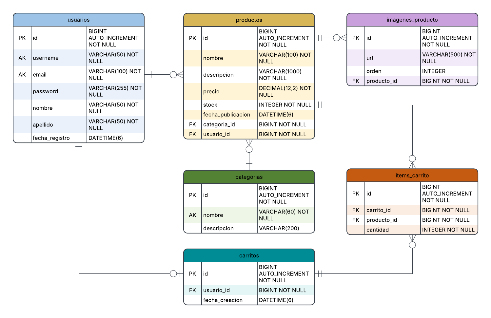

# G6-Tp0-Ecommerce

API REST de un sistema de e-commerce, desarrollada como Trabajo Practico
Obligatorio de Aplicaciones Interactivas (UADE, 2do cuatrimestre 2026).
Resuelve el registro y login de usuarios con roles de cliente y vendedor, el
catalogo de productos organizado por categorias, la gestion de publicaciones con
sus fotos y su stock, el carrito de compras y el checkout, que calcula el total,
valida el stock disponible y lo descuenta dentro de una unica transaccion.
Construido con Java 17, Spring Boot, Spring Data JPA y Maven.

---

> **Estado: los 9 modulos estan implementados y mergeados en `main`.**
> El flujo completo del enunciado corre de punta a punta: registro, login,
> catalogo, publicacion de productos con fotos, carrito y checkout.
> Ver [Reparto de modulos](#reparto-de-modulos).

## Documentación interactiva de la API (Swagger / OpenAPI)

Una vez levantada la aplicación, la documentación interactiva con Swagger UI y la especificación OpenAPI están disponibles en:

- **Swagger UI:** [http://localhost:8080/swagger-ui.html](http://localhost:8080/swagger-ui.html) (o [http://localhost:8080/swagger-ui/index.html](http://localhost:8080/swagger-ui/index.html))
- **OpenAPI JSON Spec:** [http://localhost:8080/v3/api-docs](http://localhost:8080/v3/api-docs)

Desde Swagger UI se pueden explorar todos los endpoints y probar peticiones interactivamente (Catálogo, Productos, Imágenes, Categorías, Carrito y Checkout).

## Como levantar el proyecto

Solo hace falta **JDK 17**. La base por defecto es H2 en memoria, asi que no hay
que instalar ninguna base de datos.

```bash
./mvnw spring-boot:run
```

En Windows, desde PowerShell:

```bash
.\mvnw spring-boot:run
```

La API queda en `http://localhost:8080`.

### Verificar que las tablas se crearon (consola de H2)

Abrir `http://localhost:8080/h2-console`:

| Campo | Valor |
|---|---|
| JDBC URL | `jdbc:h2:mem:ecommercedb` |
| User | `sa` |
| Password | *(vacio)* |

> El formulario viene con `jdbc:h2:mem:testdb` precargado. **Hay que cambiarlo**
> por `jdbc:h2:mem:ecommercedb` o Connect falla, y el error aparece chiquito
> debajo del formulario.

Deberian verse 6 tablas: `usuarios`, `categorias`, `productos`,
`imagenes_producto`, `carritos`, `items_carrito`.

### Correr contra MySQL (opcional)

Con un MySQL escuchando en `localhost:3306`:

```bash
.\mvnw spring-boot:run "-Dspring-boot.run.profiles=mysql"
```

La forma mas simple de tener ese MySQL es el contenedor de la clase 03. Se
ejecuta **una sola vez**:

```bash
docker run --name mysql-uade -e MYSQL_ALLOW_EMPTY_PASSWORD=yes -p 3306:3306 -d mysql:8.0
```

De ahi en mas, cada dia alcanza con `docker start mysql-uade` (y
`docker stop mysql-uade` al terminar). A diferencia de H2, los datos sobreviven
al reinicio de la aplicacion.

La base se llama **`ecommerce_tpo`** y la crea sola el driver. Usa un nombre
propio a proposito: si el contenedor ya tiene una base de otra practica de la
materia, Hibernate encontraria tablas con un esquema distinto y las mezclaria
con las nuestras en vez de reemplazarlas.

## Estructura

```
com.uade.TPO_Ecommerce_Grupo6
├── controller/     Endpoints REST (@RestController). Solo HTTP.
├── service/        Logica de negocio y transacciones (@Service, @Transactional).
├── repository/     Acceso a datos (@Repository, extienden JpaRepository).
├── model/
│   ├── entity/     Las 6 entidades JPA. YA ESTAN, no crear nuevas.
│   └── dto/        Objetos de entrada y salida de la API.
├── exception/      Excepciones propias + manejador global.
├── config/         Seguridad, CORS, Swagger.
└── TpoEcommerceGrupo6Application.java
```

Regla de la catedra: el Controller nunca accede al Repository ni contiene
reglas de negocio, y no maneja transacciones. Eso vive en el Service. Las
entidades nunca salen de la API: siempre se convierten a DTO (asi la password
no puede filtrarse en ninguna respuesta).

## Modelo de datos

Las 6 entidades ya estan creadas y anotadas. **No hay que crear entidades
nuevas ni renombrar las que estan** — si a alguien le falta un campo, se avisa
al grupo antes de tocarlas, porque las comparten varios modulos.

### Diagrama entidad-relacion



Hecho en Lucidchart, importando el DDL que genera Hibernate a partir de las
clases `@Entity`. El diagrama sale del esquema real, no de un dibujo hecho a
mano, asi que no puede quedar desincronizado del codigo por descuido.

Para regenerarlo si cambia el modelo: volver a exportar el DDL, reimportarlo en
Lucidchart y exportar el PNG de nuevo.

> **Pendiente:** la imagen es anterior a la separacion de roles, asi que le falta
> la columna `rol` en `usuarios` (`VARCHAR(20) NOT NULL`). El resto del esquema
> no cambio. Hay que regenerarla.

Las cuatro relaciones JPA que pide la catedra, y donde esta cada una:

| Relacion | Donde |
|---|---|
| `@ManyToOne` | Producto → Categoria, Producto → Usuario, ItemCarrito → Carrito, ItemCarrito → Producto, ImagenProducto → Producto |
| `@OneToMany` | Categoria → productos, Producto → imagenes, Carrito → items |
| `@OneToOne` | Carrito → Usuario |
| `@ManyToMany` | Ninguna directa. La de Carrito ↔ Producto esta **resuelta** con `ItemCarrito`, porque la asociacion necesita guardar la cantidad. |

Decisiones que conviene poder defender en la entrega:

- **`precio` es `BigDecimal`, no `double`**: `double` arrastra errores de
  redondeo binario y con plata eso no se perdona.
- **`ItemCarrito` es una entidad y no un `@ManyToMany`**: la asociacion entre
  carrito y producto tiene un atributo propio, la cantidad. Ese es el patron
  estandar de JPA para ese caso.
- **`ImagenProducto` es una entidad y no una lista de Strings**: la catedra pide
  demostrar relaciones JPA explicitas entre entidades reales.
- **`Usuario` tiene un rol, `CLIENTE` o `VENDEDOR`**: el profesor aclaro que un
  e-commerce tiene un vendedor fijo (el dueño del sitio, como la pagina de una
  marca), a diferencia de un marketplace donde cualquiera publica. Por eso solo
  el rol `VENDEDOR` puede dar de alta, modificar o eliminar productos. Se
  corresponde con los roles USER y ADMIN del material de la Clase 05.

## Reparto de modulos

Cada modulo es una vertical completa: su repository, su service, su controller y
sus DTOs. Las entidades ya estan y son compartidas.

| # | Modulo | Endpoints | Estado |
|---|---|---|---|
| 0 | Kickoff: esqueleto, entidades y configuracion | - | Implementado |
| 1 | Usuarios | `POST /api/usuarios`, `GET /api/usuarios/{id}` | Implementado |
| 2 | Autenticacion + errores globales | `POST /api/auth/login` | Implementado |
| 3 | Categorias (CRUD) | `GET/POST/PUT/DELETE /api/categorias` | Implementado |
| 4 | Catalogo (listado y detalle) | `GET /api/productos`, `GET /api/productos/{id}` | Implementado |
| 5 | Gestion de productos | `POST/PUT/DELETE /api/productos` | Implementado |
| 6 | Imagenes de producto | `POST /api/productos/{id}/imagenes` | Implementado |
| 7 | Carrito (items) | `GET/POST/PUT/DELETE /api/carrito` | Implementado |
| 8 | Checkout + documentacion | `POST /api/carrito/checkout` | Implementado |

## Como trabajamos

- `main` **siempre tiene que compilar y levantar**. Antes de pushear:
  `.\mvnw test`.
- Cada uno trabaja en su rama: `feature/<numero-modulo>-<nombre-corto>`
  (ej. `feature/5-gestion-producto`).
- Al terminar, Pull Request a `main` y **otro integrante lo revisa** antes de
  mergear. Mergear seguido, no todos los PRs juntos al final.
- Commits chicos y continuos, estilo conventional commits. La catedra evalua
  cantidad, calidad y continuidad de los commits **de cada uno**:

```
feat(producto): agrego el ProductoRepository con busqueda por categoria
fix(carrito): valida stock antes de descontar en el checkout
docs(readme): agrego instrucciones de levantado
```

Tipos: `feat`, `fix`, `refactor`, `test`, `docs`.

## Seguridad

### Contrasenias

Se guardan hasheadas con **BCrypt**, nunca en texto plano. `UsuarioResponse` no
tiene el campo password, ni siquiera hasheado: ese es el motivo concreto por el
que la consigna pide DTOs en vez de devolver la entidad.

El login (`POST /api/auth/login`) busca al usuario por email y compara la
contrasenia con `passwordEncoder.matches()`. No se puede resolver con una
consulta `WHERE email = ? AND password = ?` porque BCrypt usa salt: cada vez que
se hashea la misma contrasenia sale un hash distinto.

Si las credenciales son incorrectas responde **401**, con el mismo mensaje tanto
si el email no existe como si la contrasenia esta mal. Es deliberado: si
distinguiera los dos casos, cualquiera podria averiguar que direcciones estan
registradas probando de a una.

### Roles

`Usuario` tiene un rol, `CLIENTE` o `VENDEDOR`. Solo el `VENDEDOR` puede
publicar, modificar o eliminar productos; el `CLIENTE` navega, arma el carrito y
compra. Quien intenta una operacion que su rol no permite recibe **403**.

El registro crea un `CLIENTE` salvo que se pida otro rol explicitamente:

```json
POST /api/usuarios
{ "username": "tienda", "email": "tienda@sitio.com", "password": "secreto123",
  "nombre": "Mi", "apellido": "Tienda", "rol": "VENDEDOR" }
```

### Que falta para cerrar la seguridad

Las dependencias de `jjwt` estan en el `pom.xml`, pero **el login todavia no
emite un token JWT**: devuelve los datos del usuario. Mientras eso no exista, el
`usuarioId` viaja en el cuerpo de cada request, asi que las validaciones de rol
y de dueño se apoyan en un dato que manda el cliente. Es la mejora numero uno
para una proxima entrega: cuando el usuario salga del token, el campo
`usuarioId` desaparece de `ProductoRequest` y de los parametros del carrito.

`config/SecurityConfig.java` abre todos los endpoints (`permitAll`) por el mismo
motivo: sin token que validar, cerrarlos dejaria la API inutilizable.

> Ojo con la version de `jjwt`: la Clase 05 fija la **0.11.5**, y la API cambio
> bastante en la 0.12.x. Un tutorial de 0.12 no compila contra esta.

## Entrega

**Martes 8 de septiembre de 2026, 23:59.** El material de la catedra traia dos
fechas distintas para la misma entrega; esta es la confirmada.

Checklist de la consigna:

- [ ] Archivo `.zip` con el codigo fuente subido a la actividad de BSP
- [ ] Link al repositorio de GitHub del equipo incluido en la entrega
- [ ] **Nombre del repositorio: `back-nombreProyecto`** (ej. `back-ecommerce`).
      Hoy el repo se llama `G6-Tp0-Ecommerce`, que **no respeta ese formato**.
      Renombrarlo en GitHub es un click, en Settings, y no rompe los clones
      existentes porque GitHub deja una redireccion.
- [x] `README.md` con descripcion y alcance en **maximo 7 lineas** (las de
      arriba son exactamente 7) y debajo el detalle tecnico y funcional
- [x] Los 3 puntos de la consigna funcional: la app cumple los requerimientos,
      tiene capa de persistencia agregada y expone una API REST construida
- [x] Arquitectura en capas completa (Controller / Service `@Transactional` /
      Repository `@Repository` / Entity / DTO)

## Decisiones que faltan tomar en equipo

1. **`Pedido` / `ItemPedido`**: el enunciado no pide historial de compras, solo
   que el checkout calcule el total y descuente stock. Queda como candidato a
   "funcionalidad extra" si sobra tiempo. Define el Modulo 8.
